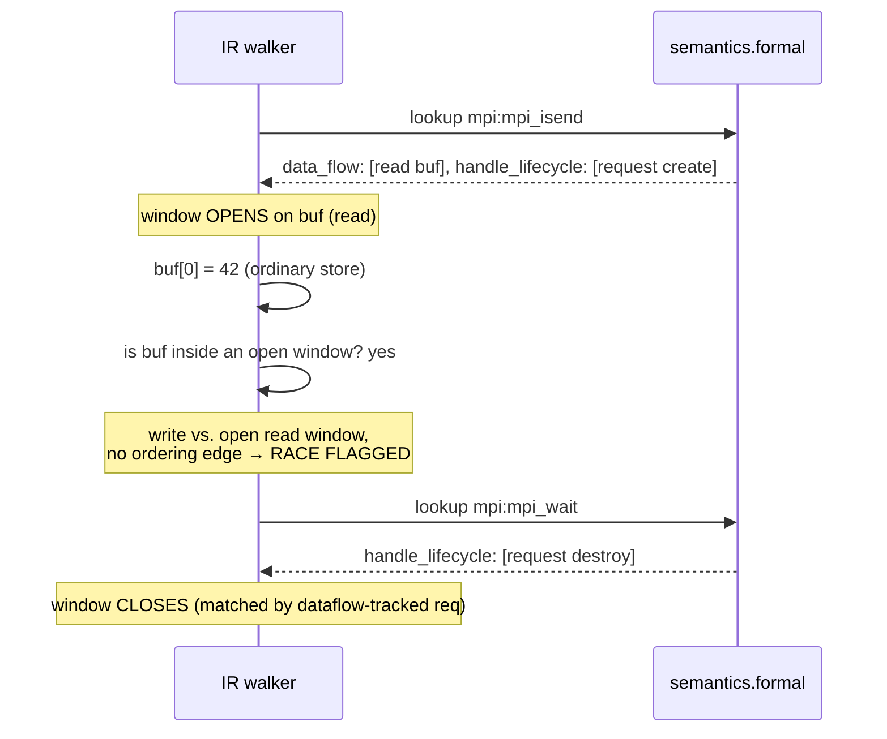

# How a Tool Consumes `semantics.formal`

The abstract schema, walked by one concrete consumer: a data-race detector in an SPMD compiler IR. It keeps the schema honest about being consumable, not just complete on paper.

## Two consumer classes, two different walks over the same structure

- **Code generator** — per call site, per participant: resolve which role the current code plays (`participants[].selector`), then for each relevant `data_flow` entry, lower `read`/`write` with `source.kind: "structural"` into a local load/store or an actual transfer primitive if the paired entry belongs to a different participant; lower `source.kind: "matched"` into a receive/wait-for-match primitive; lower `source.kind: "reduced"` into a reduction call using `operation_ref` (slicing the result at `source.offset` when present — reduce_scatter); lower `source.kind: "gathered"` into an all-gather/assembly primitive placing each contribution at `placement_offset`. Then walk `sync.events`/`ordering`/`matching` to insert barriers, tag-matched sends/receives, or epoch calls at the right points.
- **Verifier** (static or runtime, e.g. a MUST-style collective-matching checker or the SPMD IR race detector below) — per observed or modeled call instance: instantiate `participants` against the actual process/PE/thread count to determine which real call instances belong to the same logical operation (this is the collective-matching check MUST currently hand-codes per function, expressed declaratively instead); for every `data_flow` entry with `source` set, emit a data-equality obligation; for every `sync.ordering`/`matching` entry, emit an ordering or pairing obligation over the instance graph.

Both consumers only ever need to understand a small, fixed vocabulary — 4 `data_flow[].op` values and 4 non-null `source.kind` values — plus the reference/selector grammar (formally specified in `docs/schema/reference-grammar.md`) and the `inputs[].scope` registry (`docs/schema/semantics-formal.md`), which are honestly part of the consumer contract too — regardless of corpus size. That ceiling on consumer-side complexity is the point of the whole design; see `docs/schema/design-conventions.md`.

**What the code generator's lowering step still can't do from the JSON alone.** For the SPMD IR code generator specifically, the JSON only drives the model-external, declarative part of lowering — operand reordering, type selection, attribute assignment. A compact C++ plugin layer still has to handle ABI-constant resolution and pointer-to-MemRef recovery, since those are inherently implementation-specific (compiler ABI, memory representation) rather than semantic facts about the PPM call. This is a known, intentional limitation of the architecture, not a flaw in the schema: the format encodes *semantic* knowledge, not *encoding* knowledge, and the two are deliberately kept in different layers.

## Worked example: catching a send-buffer race

The bug class: writing into a send buffer while a nonblocking send is still in flight.

```c
MPI_Request req;
MPI_Isend(buf, count, MPI_INT, dest, tag, comm, &req);
buf[0] = 42;              // race: buf is still "owned" by the in-flight send
MPI_Wait(&req, &status);
```

`buf[0] = 42` is ordinary local code — nothing in the schema describes it, and it shouldn't. What the schema describes is how long `Isend` keeps a claim on `buf`, and which call releases that claim.

### The five-step walk

1. Walk the IR; for each call to a modeled function, look up its `semantics.formal`. If `null`, skip — nothing to check.
2. Evaluate `participants[].selector` to resolve which role this call site plays (usually trivial — a call the code itself makes is always `self`).
3. For each `data_flow` entry belonging to that role, resolve `buffer`/`extent` to an IR value and size, and note the access kind. The access window *opens* here.
4. Find where the window *closes*: if a `sync`/`handle_lifecycle` entry is bound to a handle, dataflow-track that handle value in the IR until the call that consumes it and reaches its matching completion point. Otherwise the window closes at return.
5. Flag a conflict if any IR memory access overlapping that buffer region falls inside the open window with no ordering edge to it, and at least one side is a write.

### The trace



| # | Program point | What the tool does | Window on `buf` |
|---|---|---|---|
| 1 | `MPI_Isend(buf, ...)` | Looks up `mpi:mpi_isend.formal`. One `data_flow` entry: read, `param:buf`. Opens a window. | **open**: read |
| 2 | same call | `handle_lifecycle` shows `param:request`, role `create` — tags the window with the IR value written into `req`. | tagged with `req` |
| 3 | `buf[0] = 42;` | Ordinary IR store to `buf`. Is `buf` inside a currently open window? Yes. | conflict candidate |
| 4 | (window still open) | Access kind = write; open window's kind = read; no ordering edge exists to this store. | **race flagged** |
| 5 | `MPI_Wait(&req, ...)` | `handle_lifecycle` shows `role: destroy` for `param:request`; the tool matches `req` by dataflow and closes the window here. | closes |

The diagnostic — which buffer, which call opened the claim, which call closes it — comes straight out of `data_flow` and `handle_lifecycle`; the tool never special-cased `Isend`/`Wait` by name. Move the store after `Wait` and step 3 happens outside every open window — no conflict candidate is even generated, with no separate "is this safe" rule needed.

## An explicit, honest boundary

Step 5 above still needs the compiler's own alias/points-to analysis to decide whether `buf[0]` really overlaps `param:buf`'s extent. **The schema's job stops at telling the tool when a window is open and on what region — it doesn't replace the tool's own memory model.** This division of labor was stated explicitly and is treated as a deliberate design boundary (see the R5/tool-agnostic principle in `docs/schema/design-conventions.md`), not an oversight to eventually fix by adding alias analysis to the schema itself.
