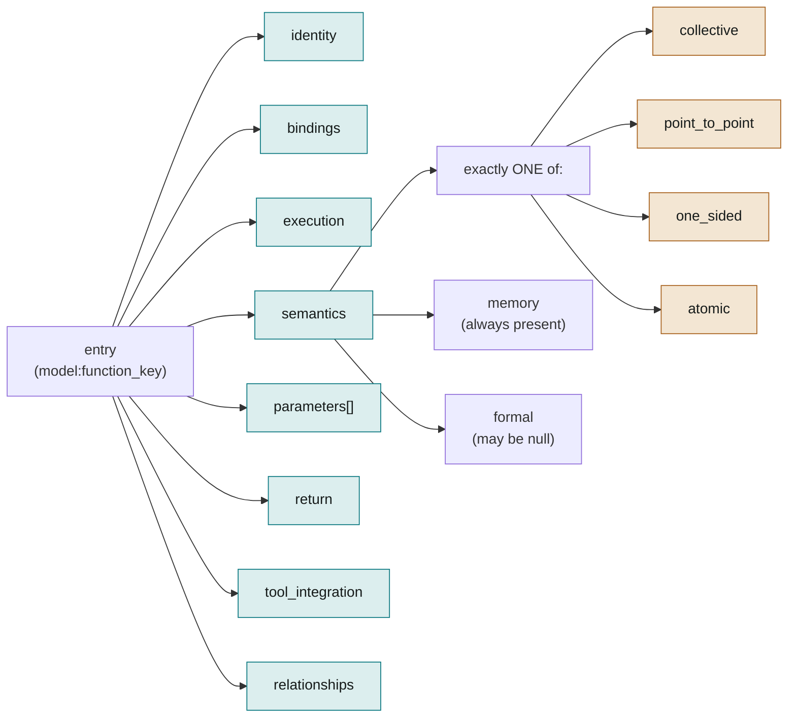

# Schema Overview: The Base Entry Format

The eight top-level sections every entry has, and why each exists. `curated/schemas/api-schema.json` (`$defs/entry` and the `$defs` it references) is authoritative for exact field names, types and enums; this document explains what each section is for.

## Structure at a glance

## The eight sections

Every entry (keyed `model:function_key`, e.g. `mpi:mpi_bcast`) is an object with exactly these eight required properties. None may be omitted; where a field doesn't apply, it's present with value `null` (see "always present, explicitly null" in `docs/schema/design-conventions.md`).

### 1. `identity`

Provenance and classification: `model` (which PPM), `name` (canonical function name, may contain a `{T}` placeholder for type-generic families), `api_group`, `since`/`deprecated_in` (version lifecycle), `standard_refs` (citations), `desc` (one-line description), `type_family` (the concrete type suffixes this entry is generic over, e.g. `["int","long","float"]` — see the note on type-genericity below).

**Type-genericity note:** `type_family` collapses the *type* axis (an entry generic over `int`/`long`/`float`/...) but explicitly does **not** collapse the *operation* axis. `shmem_int_add` and `shmem_int_fetch` are different operations and get different entries even though both could in principle share a type family — collapsing operation and type into one axis would hide real semantic differences (fetch vs. non-fetch, compare vs. non-compare) behind a single generic entry.

NVSHMEM and OpenSHMEM use this mechanism. `bindings.c.signature` uses a second placeholder, `{CT}`, for C-type positions, kept distinct from `{T}` because typename and C type sometimes differ for the same logical type (`("longlong","long long")`, `("bfloat16","__nv_bfloat16")`). Shipped entries are always concrete: the workflow's Concretize step (`workflow/concretize/`) expands each family into one entry per type, with `type_family` set to `null`, and every earlier stage works on the generic family once.

### 2. `bindings`

Per-language signature information: `c`, `fortran90`, `fortran08`, `lis`, `cpp`. Each is either a structured object (header, signature, language-specific flags) or `null` if that PPM doesn't support that language binding. Do not confuse with shape-expansion `bindings` — see glossary.

### 3. `execution`

When and where a call executes. Eleven fields, always all present: `blocking`, `execute_once` (true only for process-lifetime singletons the standard forbids repeating — `MPI_Init`/`MPI_Init_thread`/`MPI_Finalize` and nothing else across the six models; not for ordinary collectives, and not for an init routine a standard allows you to call again — a common confusion), `collective`, `thread_safety`, `launch` (where in program text it may be issued from — `cpu`/`gpu`/`cpu+gpu`), `runs_on` (what hardware actually does the work — independently variable from `launch`; see the NCCL counterexample below), `gpu_scope`, `stages` (MPI-4 procedure taxonomy: init/start/complete/free), `locality`, `completion`, `procedure_class`.

**Why `launch` and `runs_on` are separate fields:** `ncclAllReduce` is `launch: "cpu"` (only host-callable) but `runs_on: "gpu"` (the actual reduction happens on-device). Collapsing these into one field would lose real information a code generator needs.

**Values here aren't always fixed by the symbol alone.** Where a field's effective value depends on runtime context rather than being determined by which function is being called (the canonical example: NCCL's `blocking` depends on communicator config and `ncclGroupStart`/`ncclGroupEnd` nesting), the value given here is the *default* case, and the actual dependency is recorded in `tool_integration.context_dependencies`.

### 4. `semantics`

The section with the most internal structure. Exactly **one** of four conditional sub-objects is non-null: `collective`, `point_to_point`, `one_sided`, `atomic`. `memory` is always present as a key but may be `null` when no memory-semantics contract applies (query and management calls). `formal` is always present but may be `null`; see `docs/schema/semantics-formal.md`. Which sub-object is non-null is itself the operation class; there is no separate field for it (an OpenSHMEM atomic is legitimately `one_sided` *and* has a non-null `atomic`).

- `semantics.collective` — `type` (broadcast/reduce/allreduce/scatter/gather/allgather/alltoall/scan), `root_involved`, `in_place`, `comm_scope`, `algorithm_class`, `reduction_op`, `topology_aware`.
- `semantics.point_to_point` — `direction` (send/receive/send_receive), `synchronous`, `buffered`, `ready`. This is what distinguishes MPI's near-identical-signature send-mode family (`Send`/`Ssend`/`Bsend`/`Rsend`) from each other. The three mode booleans are nullable: `null` = not applicable (receives) or implementation-defined (standard-mode `Send`'s buffering, paired with a `context_dependencies` entry).
- `semantics.one_sided` — `operation` (put/get/accumulate/fetch_op/compare_swap), `epoch_type` (fence/pscw/lock/lockall/implicit), `ordering`.
- `semantics.atomic` — `operation`, `fetch`, `compare`.
- `semantics.memory` — always present regardless of which sub-object is non-null: `local_completion`, `remote_completion`, `buffer_reuse`, `fence_semantics`, `symmetric_heap`, `memory_model`.
- `semantics.formal` — see `docs/schema/semantics-formal.md`.

### 5. `parameters`

An array, one entry per formal function argument. Each parameter has: `name`, `kind` (a closed enum in `$defs/parameter_kind`, shared with `return.value_kind`: `BUFFER`, `COUNT`, `RANK`, `TEAM_SIZE`, `DATATYPE`, `COMMUNICATOR`, `GROUP`, `OPERATION`, `SIG_OP`, `TAG`, `STATUS`, `REQUEST`, `MESSAGE`, `TEAM`, `WINDOW`, `FILE`, `SESSION`, `INFO`, `ERRHANDLER`, `KEY`, `ERROR_CODE`, `STREAM`, `DEVICE`, `THREAD_LEVEL`, `SCALAR`, `BOOL`, `STRING`, `ID`, `INDEX_ARRAY`, `OPAQUE_STATE`, `TOOL_HANDLE`, or `null`), `direction` (in/out/inout), `desc`, per-language `binding_type`, `asynchronous`, `constant`, `pointer`, `array_type`, `func_type`, `length` (cross-reference to another parameter, e.g. a buffer's `length` referencing its `count` parameter by name), `parameter_bindings` (which language/large-count/optional variants exist), `root_only`, `constraints` (`not_null`, `value_range`, `paired_with`), and `memory_space` (see `docs/schema/gpu-memory-semantics.md`).

The enum grows only when a complete entry needs a new value (e.g. `STREAM` for NCCL's `stream` parameter, `SCALAR` for by-value atomic operands). Open candidates are logged in `docs/cross-ppm-analysis/known-gaps-and-open-questions.md`.

### 6. `return`

`kind` (ERROR_CODE/RESULT/void/bool/value), `value_kind` (what a returned value is, in the parameter kind vocabulary — `RANK` for `shmem_my_pe`, `TEAM_SIZE` for `omp_get_num_threads`, `DEVICE` for `omp_get_device_num`; null unless `kind` is `value`), per-language `binding_type`, `possible_errors`, `possible_successes` (both arrays of string tokens, not full sentences).

### 7. `tool_integration`

Hooks for correctness and performance tools. `profiling_name` (e.g. the `PMPI_`/`PNCCL_` naming-convention rename), `invariants` (preconditions, expressed in the shared reference grammar — see `docs/schema/reference-grammar.md`), `buffer_aliasing` (forbidden/allowed/in_place_only), `context_dependencies` — the mechanism for any field elsewhere in the entry whose effective value isn't fixed by the function symbol alone (see the NCCL `blocking` example above, and the CUDA-aware-MPI `memory_space` example in `docs/schema/gpu-memory-semantics.md`). Each `context_dependency` entry names the field (dotted path, e.g. `execution.blocking` or `param:buf.memory_space`), states a default value, lists what it actually depends on, and gives a short note.

### 8. `relationships`

Links between related entries, and **nothing else**: `variants` (nonblocking/blocking/persistent/neighborhood/host/gpu counterparts of this function, each a `model:function_key` string or `null`), `superseded_by`, `supersedes`.

`superseded_by` (string or `null`) and `supersedes` (array, possibly empty) are the two directions of one edge. A `model:function_key` is a cross-entry reference, and every reference in the schema lives in this section, while every field in `identity` is self-describing. `supersedes` is an array because supersession is many-to-one, and it is **derived mechanically** by inverting the corpus's `superseded_by` values (`workflow/assemble/assemble.py`'s `_derive_supersedes`), never authored: hand-maintaining both directions of one edge is how a graph gets out of sync.

## Why eight sections

Separating what a call is named and how to call it (`identity`, `bindings`) from what it does (`semantics`) and what its arguments mean (`parameters`) keeps each section to one concern. That is why the schema has grown by adding fields to the right existing section, or a new sub-concern such as `semantics.formal`, without restructuring the top level.

## Later additions to the base format

Two concerns the original eight sections could not express, added later:

- **Operational data-flow/synchronization detail** — filled by `semantics.formal`. Without it, the base format could classify a call but not describe what it actually does to memory.
- **Memory locality (host/device/symmetric heap)** — filled by `parameters[].memory_space`. Without it, nothing in the schema would say whether a buffer argument lives in host RAM, device memory, or a PGAS symmetric heap.
