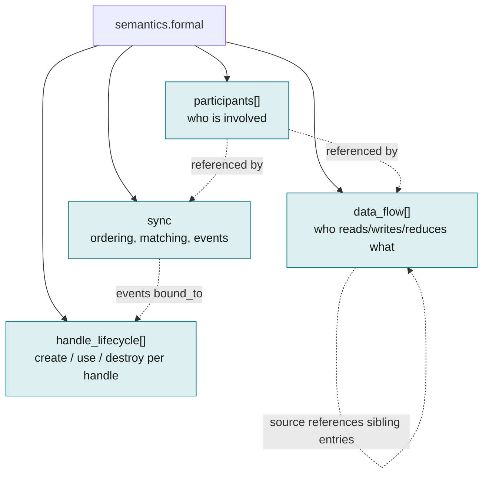

# `semantics.formal`: The Operational Data-Flow and Synchronization Layer

The technically deepest part of the schema: what it captures, why each piece exists, and how the pieces compose.

## The gap it fills

Before this layer existed, the schema could classify a call (`semantics.collective.type = "broadcast"`) but not describe it operationally: who touches what memory, in what order, relative to whom. That's the difference between a sentence a human can read and a sentence a tool can act on. Compare, for `mpi:mpi_bcast`:

- **Classification only:** "This is a collective, type broadcast, root involved, not in-place."
- **With `semantics.formal`:** "The root reads `count` elements of `datatype` from `buffer`; every non-root participant writes the same extent into its own `buffer`, and that write's value is exactly the root's read; no participant returns until every participant has entered."

The second version is directly actionable: a code generator lowers it into a transfer primitive, a verifier lowers it into a data-equality obligation plus a collective-matching check.

`semantics.formal` is `null` for entries where it doesn't earn its keep — most query and `management`-class calls, whose correctness is already fully carried by `execution.stages` and `tool_integration.invariants`.

## The four sub-fields

| Field | Question it answers | Present when |
|---|---|---|
| `participants` | Who is involved, and does each one actually invoke the function? | Always, whenever `formal` is non-null |
| `data_flow` | Who reads, writes, or reduces which memory, and where does a written value come from? | Communication ops; empty array for pure-sync ops like barrier |
| `sync` | What ordering must hold between participant instances, and how are separate call instances matched to each other? | Always, whenever `formal` is non-null |
| `handle_lifecycle` | Does this call create, use, or destroy a long-lived handle (request, window, communicator, symmetric-heap allocation, file, session)? | Handle-bound ops; empty array otherwise |

### `participants`

A list of roles a single call instance decomposes into. Fields: `id`, `role_kind` (`initiator`/`member`/`passive_target`), `calls_function` (boolean), `cardinality` (`one`/`many`), `selector` (a predicate in the reference grammar, e.g. `rank == param:root`).

`calls_function: false` does real work: it's what tells a static analyzer that the passive target of a one-sided operation (e.g. the target rank of `mpi_put`) never has a matching call site of its own on that rank — a distinction that trips up naive collective-matching checkers if not represented explicitly.

### `data_flow`

One entry per memory access. Fields: `id`, `participant` (null for reduce nodes, which aren't scoped to a single participant), `op` (`read`/`write`/`reduce`/`read_modify_write`), `buffer`, `extent` (`{count_ref, datatype_ref}`), `offset`, `inputs` (for reduce nodes), `operation_ref`, `valid_during` (epoch preconditions — see below), and `source`.

**The `source` field is where the actual verification/codegen value lives.** It's a tagged object stating where a written value provably came from:

| `source.kind` | Means | Example |
|---|---|---|
| `structural` | Copy from a named sibling `data_flow` entry in the *same* call instance | bcast, put |
| `reduced` | Aggregation over a scoped set of sibling reads; an optional `offset` slices the result per recipient | allreduce, scan, (with a two-party scope — see below) accumulate, and (with `offset`) reduce_scatter |
| `gathered` | Per-participant assembly of a named sibling read across a scope, with **no operator** — each contribution lands at `placement_offset`, evaluated in the *contributing* participant's context | allgather, SHMEM fcollect |
| `matched` | Resolved at runtime by a `sync.matching` rule against a *separate* call instance | irecv |
| `null` | Comes from implementation/runtime state — not modeled | query calls |

**Why `gathered` needed to be its own kind rather than an operator-less `reduced`:** `reduced`'s whole meaning is an aggregation *node* (`op: "reduce"`, an `operation_ref`); allgather has no aggregation at all — every contribution survives verbatim, distinguished only by placement. Encoding that as a fake reduction with a null operator would have handed both consumer classes a value that looks like a reduction and isn't. The `collective.gather_to_all` and `collective.reduce_scatter` shapes are built on it.

**Why `reduce` needed to be its own `op` rather than folding into `write`:** a bare `structural` reference works for a 1:1 copy (bcast, put) but breaks for reductions — the written value is a function over *all* participant instances' reads, not any single sibling. `reduce` is an aggregation node with no single owning participant; its `inputs` array states which sibling reads feed it and with what `scope`.

**`inputs[].scope`** says which reads a reduce node aggregates: `all_participant_instances` (allreduce), `instances_before_self_in_order` (scan: the same reduce node with a different scope, no new op needed), or `rma_target_prior` (the two-party case: `MPI_Accumulate` combines the origin's incoming value with the *target's own resident value*, not a read by another call instance).

Why `scope` is a free string rather than a closed enum: `data_flow_entry.inputs[].scope` was deliberately left open in the schema (`{"type": "string"}`, no enum) so that a new scope value such as `rma_target_prior` does not need a validation-breaking version bump the way a new `handle_kind` value would. The asymmetry is deliberate.

**The scope registry.** Open in the schema does not mean open in the consumer contract: a verifier deriving a reduction obligation *must* interpret `scope`, so an undocumented value is as damaging as an undocumented enum value. The table below is therefore the registry of every legal `inputs[].scope` value, and a new value is added here, with the function that grounds it, when it first appears in a shape or entry: schema-open, registry-closed. Validate does not check entries against the registry yet. Current registry:

| Scope value | Meaning | Grounded in |
|---|---|---|
| `all_participant_instances` | Aggregate over every participant instance's read | allreduce |
| `instances_before_self_in_order` | Aggregate over the instances ordered before self | scan |
| `rma_target_prior` | Two-party: the origin's incoming value combined with the target's own resident value | `MPI_Accumulate` |

**`matched.via`.** When `source.kind == "matched"`, the required `via` field holds **the `id` of the `sync.events` entry that gates when the matched value becomes valid** (e.g. `"local_complete"` for `handle_bound.post_recv` — the received buffer is only readable once that completion event has occurred). A consumer may rely on `via` resolving to a `sync.events[].id` of the same entry; Validate checks that it does.

**`offset`** is `null` for uniform-copy shapes (every participant gets an identical extent, e.g. bcast) and a reference-grammar expression for indexed shapes (each participant's slice is offset by its rank, e.g. scatter).

**`valid_during`** — a list of `{epoch_scope, bound_to, role}` preconditions a `data_flow` entry must fall inside. This is how RMA transfers inside an epoch-bound region (e.g. `mpi_put` used between `MPI_Win_start`/`MPI_Win_complete`) get checked: the write is only valid while *both* the origin's access epoch and the target's exposure epoch are open on the same window.

### `sync`

Three parts:

- **`events`** — named points (`event_type: "point"`) or interval endpoints (`event_type: "open_epoch"`/`"close_epoch"`), each tied to a `participant`, optionally `bound_to` a handle parameter, optionally scoped `epoch_scope: "access"`/`"exposure"`, optionally tied to a `group_ref`.
- **`ordering`** — happens-before relationships between events, `scope`d to `same_participant_instance`, `all_participant_instances`, or `cross_call`.
- **`matching`** — states how separate call instances pair up.

| `matching.kind` | Pairs instances by | Used by |
|---|---|---|
| `collective_rendezvous` | Every instance in the participant group, no key needed | bcast, barrier, allreduce |
| `tag_match` | comm + tag + source/dest, non-overtaking | MPI `isend`/`irecv` |
| `peer_match` | comm + peer rank, program order within a group, no tag | NCCL `send`/`recv` — NCCL has no tag concept, so this needed its own matching kind distinct from `tag_match` |
| `group_match` | Set equality/overlap of an explicit process group | MPI PSCW epochs |
| `epoch_scoped` | Deferred to an enclosing epoch — no matching at this call site | RMA put/get inside a lock/fence region |

### `handle_lifecycle`

Tracks a handle across its `create` → (any number of) `use` → `destroy` interval. Fields: `handle` (a `param:` ref, or `return_value` for handles created by return, e.g. `nvshmem_malloc`), `handle_kind` (`REQUEST`/`WINDOW`/`COMMUNICATOR`/`DATATYPE`/`SYMMETRIC_ALLOCATION`/`FILE`/`SESSION`), `role` (`create`/`use`/`destroy`), and optionally `derived_from` (for a `create` that also consumes an existing handle, e.g. `MPI_Comm_split`'s `newcomm` is `derived_from` `comm`).

**This mechanism unifies three things that look separate:**
1. Nonblocking request completion (`isend`/`wait`) — a point event `bound_to` a `REQUEST` handle, created at post, destroyed at wait.
2. RMA epochs (fence, lock/unlock, PSCW) — the same handle-interval mechanism, generalized from a *point* event to an *interval* (`open_epoch`/`close_epoch`), because PSCW in particular brackets an unbounded, unnamed-at-authoring-time number of intervening `Put`/`Get` calls.
3. Plain resource lifecycle (window/communicator/symmetric-heap creation and destruction) — the degenerate case of the same interval mechanism with no epoch pairing at all.

The same mechanism also covers persistent operations (`Start`/`Wait` re-open and re-close the same handle's interval repeatedly) and split collective I/O (`File_write_at_all_begin`/`_end`, with the `FILE` handle kind). Five real patterns need no mechanism beyond this one, only the `FILE` and `SESSION` handle kinds.

## Why epochs are intervals, not points

Request completion (`isend`/`wait`) needs only a *point* event bound to a handle. RMA epochs do not fit that: `MPI_Win_start`...`MPI_Win_complete` brackets an arbitrary, unbounded number of `Put`/`Get` calls in between, none of which are named at schema-authoring time. Three additions made this representable without a predicate language:

1. `sync.events[].event_type` has `"open_epoch"`/`"close_epoch"` alongside point events, each optionally carrying `epoch_scope` and `group_ref`.
2. `data_flow[].valid_during` — a precondition list a transfer must fall inside.
3. `matching.kind: "group_match"` — an epoch on one side is only well-formed if it pairs against a matching group on the other side.

The three epoch patterns use this same mechanism with different matching:

| Epoch kind | Matching | Group needed? | Example |
|---|---|---|---|
| Fence | `collective_rendezvous` | No — implicitly all ranks in the window's communicator | `MPI_Win_fence` |
| Lock/unlock | Trivial pairwise | No — one origin, one target | `MPI_Win_lock`/`unlock` |
| PSCW | `group_match` | Yes — explicit process group | `MPI_Win_start`/`post`/`complete`/`wait` |

## Not yet representable

See `docs/cross-ppm-analysis/known-gaps-and-open-questions.md` for the full list with rationale. The two most directly relevant to this layer specifically:

- **Partitioned communication** (MPI's `Psend_init`/`Pready`/`Parrived`) needs a per-partition sub-extent with independent completion state, which nothing in `data_flow` currently expresses — every entry so far describes one whole buffer with one completion event.
- **`MPI_Type_commit`-style state transitions** — a handle stays valid but changes state, and using it before the transition is itself an error. Doesn't cleanly fit `create`/`use`/`destroy`. A fourth role (`"transition"`) is plausible, but one examined case is not enough evidence to add it.

## Alternatives Considered

Two other designs were evaluated against the participants/data_flow/sync design (Option B). The comparison explains *why* the chosen design has the shape it does.

| | **Option A — buffer-role table** | **Option B — role/action/event graph (chosen)** | **Option C — Hoare-style contracts** |
|---|---|---|---|
| What it captures | Who reads/writes which param, no linkage between them | A + explicit data provenance ("this write's value comes from that read") + scoped happens-before + matching semantics | Quantified pre/post-conditions in a logic |
| Code-gen usability | Good, but can't emit an actual transfer — no source→dest edge | Good — each `data_flow` entry is close to a statement a code generator can lower directly | Poor — needs to parse and pattern-match arbitrary predicates |
| Verification power | Weak — no data-equality obligation, no cross-rank ordering | Medium–high — data-equality/reduction edges plus explicit matching rules catch a large fraction of what a MUST-style tool cares about | Highest in principle — near-direct translation to SMT/TLA+ |
| New grammar surface | ~none | Small fixed vocabulary (role_kind/op/event enums) + the reused reference/selector grammar | A full quantified expression language (array slicing, cross-rank indexing) |
| Consistency with the project's existing style | Yes | Yes | **No** — reintroduces the "logic embedded in strings" pattern the base schema had already deliberately moved away from |
| Covers synchronization naturally | No — bolt-on needed | Yes — same vocabulary covers communication and pure synchronization (e.g. barrier) with no special-casing | Yes, but with separate quantifier machinery |

**Option A was rejected** because it captures *who* touches memory but not data *provenance* — it would tell a tool there's a potential overlap/race between two accesses, but not whether one write's value is correctness-guaranteed to equal another read's value, which is exactly the kind of obligation a verifier needs.

**Option C was rejected** specifically on the grammar-surface and style-consistency rows: writing out even the bcast example under a contract design required inventing function-like constructs (`buffer_after()`, `buffer_before()`, `participants()`) that amount to a small quantified logic — a much bigger spec surface than Option B, and the "embedded logic-in-strings" pattern the base schema had already moved away from in its own earlier iterations (removing free-text fields like `suppress` in favor of structured objects). Option C remains possible as a future, optional, higher-precision layer for entries where full formal-verification precision is worth the cost, but it is not the primary representation.

**Option B was chosen** because it gets most of Option C's verification value (data-equality edges, ordering/matching rules) while staying inside the enumerable-vocabulary style of the rest of the schema, and its `data_flow` entries are close enough to direct statements that a code generator can lower them without an intermediate translation step.

## Related documents

- `docs/schema/shape-catalog.md` — the authoring-time mechanism for not hand-writing near-identical `formal` blocks across similar functions.
- `docs/consumers/tool-consumption-model.md` — how a real consumer (the SPMD IR race detector) actually walks this structure.
- `docs/schema/examples/mpi-api.json` — complete worked entries, including their `formal` blocks.
